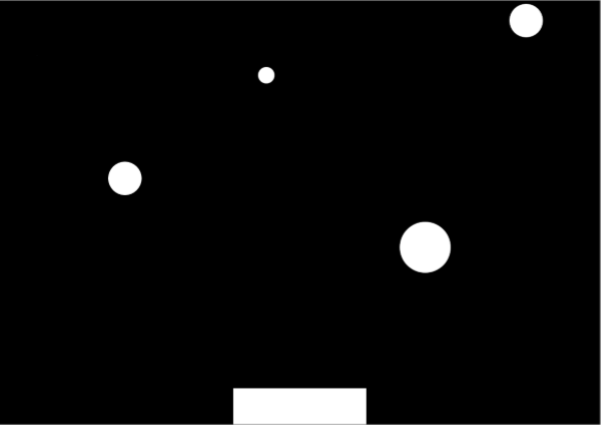
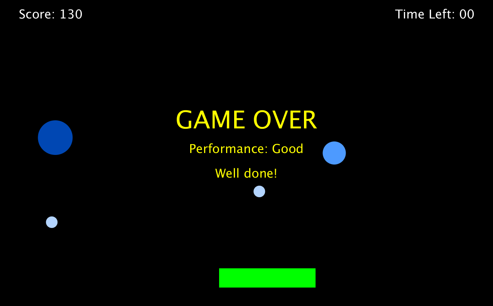
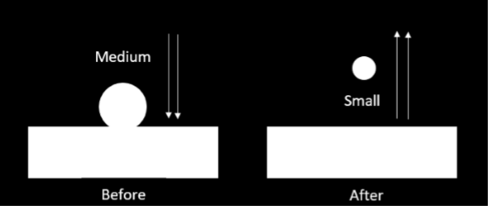
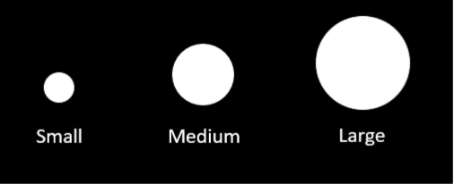
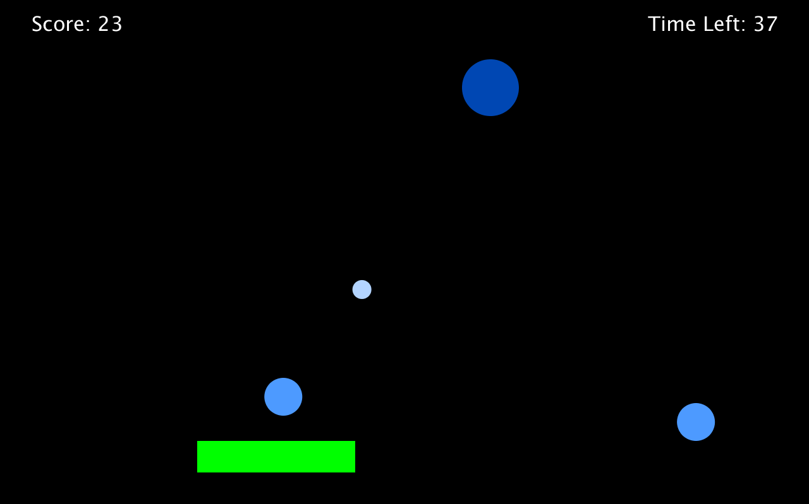

# Catch

  

## Objective:
Catch as many falling balls as possible in 60 seconds.

  

## How to play:
Use a mouse/trackpad to move the platform at the bottom of the screen to catch balls.

## Interaction:
The player interfaces with the game by controlling the platform which catches falling objects via a mouse, moving left and right on the x-axis. Audio and visuals are used to help convey events to the player; the goal is that the player should be able to understand what is occurring in the game solely off sound or visuals. Depending on the player’s capability to score, the end-screen will alter both visually and audibly to match. Falling objects interact with the user-controlled platform and bottom of the screen accordingly.

  

If a ball is large/medium, the ball will bounce.
* Large - dark blue
* Medium - blue
* Small - light blue

  

**IMPORTANT: Must install minim from library for audio**

**Enjoy!**

  

